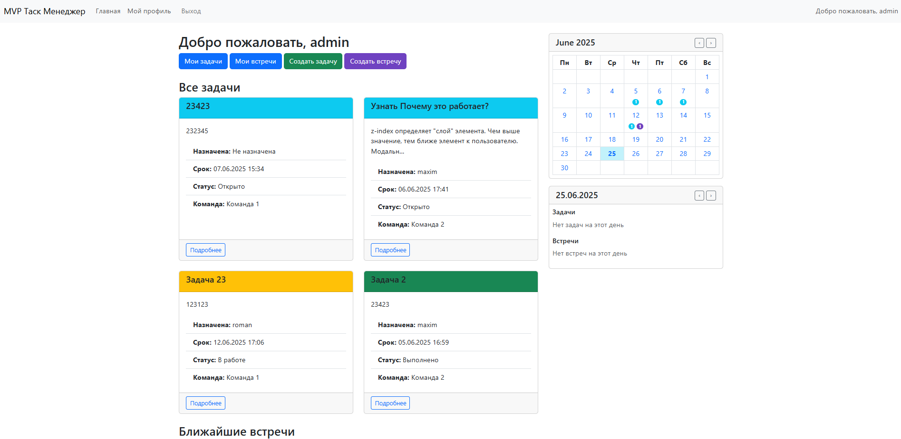
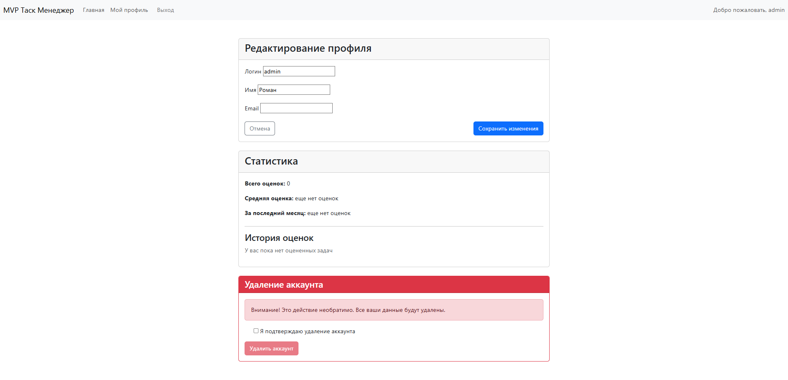
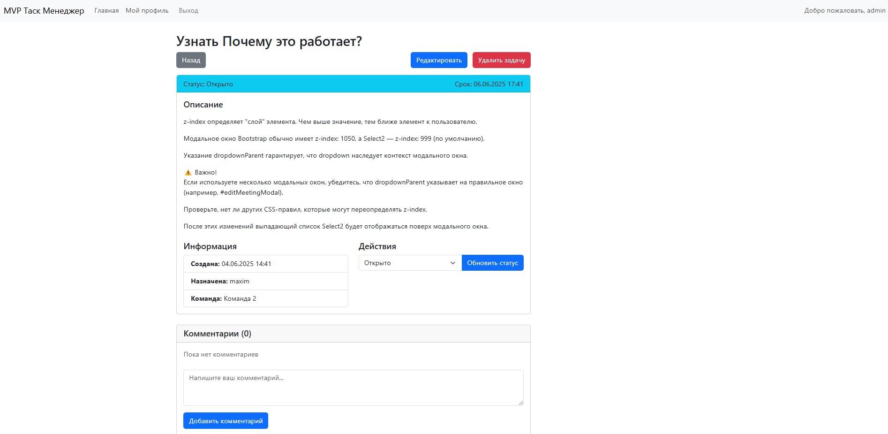

# Task Management System
## Описание
Проект — система управления задачами для команд. Позволяет управлять пользователями, командами, задачами, встречами, а также отслеживать эффективность работы сотрудников.

Реализовано на основе Django + Django REST Framework (DRF) с использованием Bootstrap/Jinja для фронтенда и JWT для авторизации.

## Технологии
`Django` — основной бэкенд  
`Django REST Framework (DRF)` — API  
`Swagger` - документация API  
`SQLite` — база данных  
`Bootstrap / Jinja2` — шаблоны и интерфейс  
`Simple JWT` — аутентификация через JSON Web Tokens  
`pytest / factory_boy /` — тестирование  
`coverage` — проверка покрытия тестов  
## Функционал
### 1. Пользователи  
Регистрация по email и паролю
Авторизация / выход
Роли: пользователь, менеджер, админ команды
Обновление профиля
Удаление аккаунта (без восстановления)
Привязка к команде по коду (опционально)
### 2. Команды  
Администратор создаёт компанию / команду
Добавление/удаление пользователей в команде
Просмотр состава команды
Назначение ролей (менеджер, сотрудник)
### 3. Задачи  
Создание задач руководителем
Назначение исполнителя
Описание, дедлайн, статус
Возможность изменения и удаления
Комментарии (упрощённый чат внутри задачи)
Статусы: "Открыто", "В работе", "Выполнено"
### 4. Оценка работы  
Руководитель оценивает выполненные задачи (баллы от 1 до 5)
Пользователь видит свои оценки
Отображение средней оценки за период
### 5. Встречи  
Назначение встречи: дата, время, участники
Проверка пересечений по времени
Список встреч пользователя
Возможность отменить встречу
### 6. Календарь  
Отображение задач и встреч по дням
Месячный и дневной вид в виде таблицы
Автоматическое добавление задач и встреч
### 7. Админ-панель  
Готовая Django Admin панель
Управление пользователями, командами, задачами
## Установка
### Шаг 1: Клонировать репозиторий

```
git clone https://github.com/Amore52/mvp_business.git
```
### Шаг 2: Установить зависимости
```
pip install -r requirements.txt
```
### Шаг 3: Выполнить миграции
```
python manage.py migrate
```
### Шаг 4: Создать суперпользователя
```
python manage.py createsuperuser
```
### Шаг 5: Запустить сервер
```
python manage.py runserver
```
Открыть `http://localhost:8000` в браузере.

## API Документация
Swagger: `http://localhost:8000/swagger/`  
ReDoc: `http://localhost:8000/redoc/`  
## Тестирование
Для запуска тестов:
```
pytest
```
С отчетом покрытия:

```
pytest --cov
```

## Главная страница


## Профиль


## Задача
